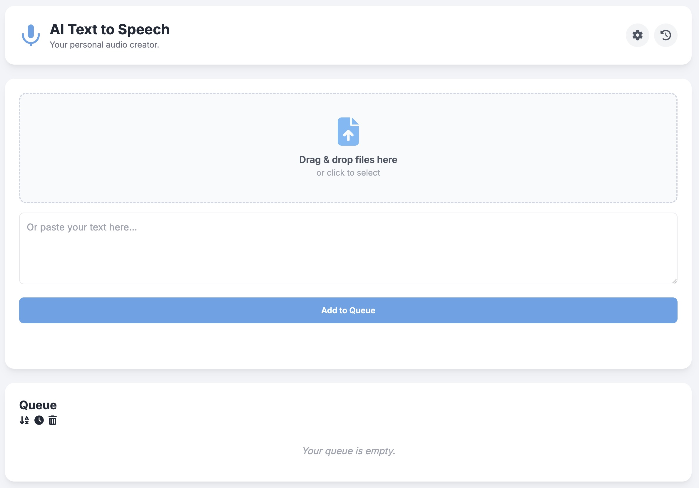

# AI Text to Speech

A web-based application that converts text from various sources (text files, PDFs, pasted content) into natural-sounding speech using Google Cloud Text-to-Speech API. It features a robust queue system, a main player, and a pop-out mini-player for continuous listening.

## ✨ Features

* **Versatile Text Input:**
    * **Drag & Drop:** Add `.txt` and `.pdf` files directly to the queue.
    * **File Input:** Select `.txt` and `.pdf` files using a file dialog.
    * **Paste Text:** Paste text directly into a dedicated area to add it to the queue.
* **Intelligent Queue Management ("Filing Cabinet"):**
    * View and manage a list of text items (files or pasted content) waiting for playback.
    * **Automatic Title Generation:** Uses Google Gemini API (if API key provided) to generate concise titles for pasted text or non-standard file types.
    * **Sortable Queue:** Sort items alphabetically or by the time they were added (ascending/descending).
    * Load items from the queue to the main player.
    * Remove individual items or clear the entire queue.
* **High-Quality Text-to-Speech:**
    * Integrates with **Google Cloud Text-to-Speech API** for audio synthesis.
    * Supports various voices (UK, US, AU Male/Female, Standard, Wavenet, Studio) with indicative cost in selection.
    * **Customizable SSML:** Advanced users can modify the SSML (Speech Synthesis Markup Language) template for fine-grained control over speech output (e.g., pauses, emphasis). A newsreader-style default is provided.
    * **Automatic Text Chunking:** Long texts are automatically split into smaller chunks (max 4500 characters) for reliable API processing.
* **Integrated Audio Player (Main):**
    * Displays the title of the currently playing item.
    * Standard playback controls: Play/Pause, Stop, Previous Chunk, Next Chunk.
    * Interactive seek bar with current time and total duration of the current audio chunk.
    * Volume control.
    * Playback speed adjustment (0.5x to 2x).
* **Pop-Out Mini Player:**
    * Launch a separate, compact player window for background listening.
    * Mirrors core functionalities: Play/Pause, Stop, Next/Previous chunk controls.
    * Independent queue management: Drag & drop, paste text, sort, and clear its own queue.
    * Utilizes API key and settings from the main application for TTS and title generation.
    * Persists its own queue and playback state via `localStorage`.
* **Session History:**
    * Automatically tracks the last 10 processed text items.
    * Access history via a slide-out panel.
    * Quickly reload any item from history for playback.
* **User-Friendly Interface:**
    * Modern UI built with Tailwind CSS and Font Awesome icons.
    * Responsive design for various screen sizes.
    * Clear visual feedback through status messages, toast notifications (for success, error, info), and modal dialogs.
* **Configuration & Personalization:**
    * Securely input and store your Google TTS API Key.
    * All settings (API key, selected voice, SSML template) are saved locally in the browser's `localStorage`.

## 🛠️ Tech Stack

* **Frontend:** HTML, CSS (Tailwind CSS), Vanilla JavaScript
* **APIs & Libraries:**
    * **Google Cloud Text-to-Speech API:** For audio synthesis.
    * **Google Gemini API (Flash model):** For automatic title generation.
    * **PDF.js (Mozilla):** For extracting text content from PDF files.
    * **Font Awesome:** For icons.
* **Storage:** Browser `localStorage` for settings and mini-player state.

## 🚀 Getting Started

### Prerequisites

* A modern web browser (e.g., Chrome, Firefox, Edge).
* **Google Cloud Text-to-Speech API Key:** This is **required** for the core text-to-speech functionality. You can obtain one from the [Google Cloud Console](https://console.cloud.google.com/). Ensure the Text-to-Speech API is enabled for your project and billing is configured.
* **(Optional) Google Gemini API Key:** For the automatic title generation feature for pasted text and non-standard files. Obtain from [Google AI Studio](https://aistudio.google.com/app/apikey).

### How to Run

1.  **Download/Clone:**
    * Download the `index.html` file.
    * Or, clone the repository:
        ```bash
        git clone [https://github.com/davidsnyder-nc/speak.git](https://github.com/davidsnyder-nc/speak.git)
        cd speak
        ```
2.  **Open in Browser:**
    * Open the `index.html` file directly in your web browser. No compilation or server is needed.

### Initial Configuration

1.  Upon first launch, or if no API key is found, the **Settings** section might be automatically open. If not, click the "Settings" (⚙️) button.
2.  **Enter your Google TTS API Key** in the designated field. This is crucial for the application to work.
3.  **(Optional)** If you want automatic title generation for pasted text, also enter your Google Gemini API Key in the same field (the app uses the same key input for both Google services, assuming it's a general Google Cloud Project key with multiple APIs enabled, or the user will use the appropriate key).
4.  **Select Voice:** Choose your preferred voice from the dropdown. Note the indicative cost hints ($, $$, $$$).
5.  **SSML Template (Optional):** Advanced users can customize the SSML template. The default is a good starting point for a natural newsreader style.
6.  Click **"Save & Close Settings"**. Your settings are saved in your browser's `localStorage`.

## 📖 How to Use

1.  **Adding Text to the Queue ("Filing Cabinet"):**
    * **Drag & Drop:** Drag `.txt` or `.pdf` files onto the designated "Drop Zone".
    * **File Input:** Click inside the "Drop Zone" or use a dedicated button (if available) to open a file dialog and select `.txt` or `.pdf` files.
    * **Paste Text:** Type or paste text into the textarea and click "Add Pasted Text to Queue".
        * A title will be automatically generated for pasted text using the Gemini API (if configured).
2.  **Managing the Queue:**
    * Items appear in the "Filing Cabinet" list.
    * **Sort:** Click the sort buttons (alphabetical or time-based) to organize the queue. Click again to toggle ascending/descending.
    * **Load & Play:** Click the play icon (▶️) next to an item to load it into the main player and start synthesis/playback.
    * **Remove:** Click the trash icon (🗑️) to remove an item from the queue.
    * **Clear Queue:** Click the dedicated "Clear Queue" button to remove all items.
3.  **Main Audio Player:**
    * Once an item is loaded, it will begin synthesizing (if not already synthesized) and playing.
    * Use the **Play/Pause, Stop, Previous/Next Chunk** buttons to control playback.
    * Adjust **volume** and **playback speed** using the respective controls.
    * The **seek bar** shows the progress of the current audio chunk.
4.  **Mini Player:**
    * Click the "Mini Player" button to open a pop-out window. **Note:** Ensure your browser allows pop-ups for this site.
    * The mini player has its own queue and playback controls, ideal for listening while working in other windows.
    * It uses the API key and voice settings from the main application.
5.  **History Panel:**
    * Click the "History" (🕒) button to open the panel.
    * It shows a list of recently played items. Click any item to reload it.
    * Click "×" or the History button again to close the panel.

## ⚙️ Key Functionalities Explained

* **Text Chunking & SSML:** Text is divided into chunks of up to 4500 characters. Each chunk is wrapped in the configured SSML template before being sent to the Google TTS API. This allows for consistent speech styling and handles API limits.
* **API Usage:**
    * **Google Cloud Text-to-Speech:** Used for converting text chunks into MP3 audio.
    * **Google Gemini API (Flash model):** Optionally used to generate short, descriptive titles for items added via pasting or for files that are not plain text/PDF where a filename isn't a good title.
* **PDF Processing:** Uses Mozilla's PDF.js library to extract text content from uploaded PDF files.

## ⚠️ Important Notes

* **API Costs:** Be aware that using the Google Cloud Text-to-Speech API and Gemini API may incur costs based on your usage. Monitor your Google Cloud billing account. The voice selection dropdown provides a relative cost indication.
* **`localStorage` Usage:** Your API keys, voice preferences, SSML template, and mini-player queue are stored in your browser's `localStorage`. This is convenient but be mindful if using a shared computer.
* **Pop-up Blockers:** You may need to disable pop-up blockers for this site to use the Mini Player feature.
* **File Support:** Primarily designed for `.txt` and `.pdf` files. Other file types might be attempted to be read as text but may result in errors or garbled content.

## 🤝 Contributing

Contributions, issues, and feature requests are welcome! Please feel free to check the [issues page](https://github.com/davidsnyder-nc/speak/issues) (if the repository is public and has issues enabled).

## 📝 License

This project is open-source. Please refer to the repository's license file for more details.

<br><br>
